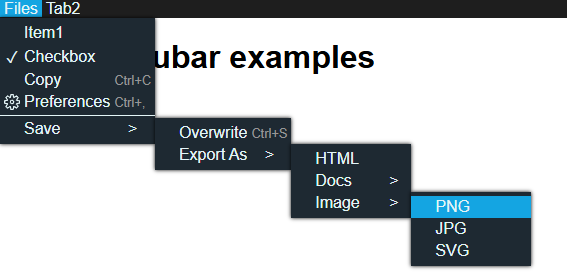
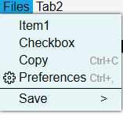

# solid-menubar

[solidjs](https://github.com/solidjs/solid) 向けのメニューバーを作成するコンポーネントライブラリ。

A component library to create app-menu bars for solidjs.

スクリーンショット / Screenshot:



ライトテーマ /Light theme :



# 目次 / contents
+ インストール / installation
+ 使い方 / usage
+ 型 / type definition

# インストール / installation
`npm i solid-menubar`

# 使い方 / usage
### インポート / import
```ts
import MenuBar from "solid-menubar";
import "solid-menubar/dist/index.css";
```

### コンポーネントを利用する / use components

詳細な例は[dev/App.tsx](./dev/App.tsx)をご覧ください。 / Detailed examples are in `dev/App.tsx`.

```tsx
const YourComponent = () => {
    return (
        <MenuBar.Container config={config}>
            <MenuBar.Group title={"Tab1"}>
                <MenuBar.ListItem onClick={()=>console.log("You clicked list!")}>
                    List1
                </MenuBar.ListItem>
                ...
            </MenuBar.Group>
        </MenuBar.Container>
    )
}

```

# 型 / type definition
型定義は[src/types.d.ts](./src/types.d.ts)にあります。 / Type definition file is in `src/types.d.ts`.
## Container -> config

```ts
interface IConfig {
    //規定のcssを無効化します。 / Disable builtin styles.
    noStyle?: boolean //default:false
    //規定cssのテーマ / theme for builtin styles.
    theme?: "light" | "dark" //default: light
    //リストアイテムのホバー及びリスト表示時のアニメーションを有効化します。
    animation?:boolean //default: false
    listItem?: {
        //<MenuBar.ListItem type={"checkbox"}> チェックボックスのチェックマークをオーバーライドします.
        //Override checkmark icon for <MenuBar.ListItem type={"checkbox"}>
        checkMarkOverride?: JSXElement
    }
    subGroup?:{
        //サブメニューの矢印を表示するかを設定します。 コンポーネントのicon propによるオーバーライドが優先されます。
        //Whether to display the submenu arrow icons. Overriding with icon prop of component is prioritized.
        showArrow?:boolean //default:true
        arrowIconOverride?: JSXElement
    }
}
```


